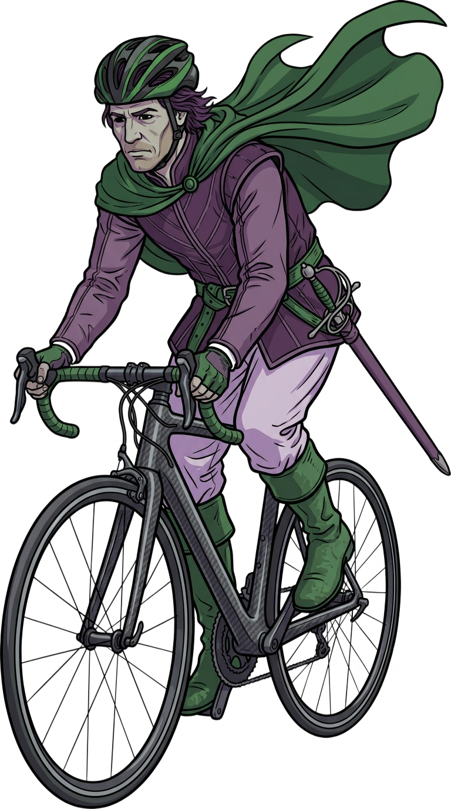
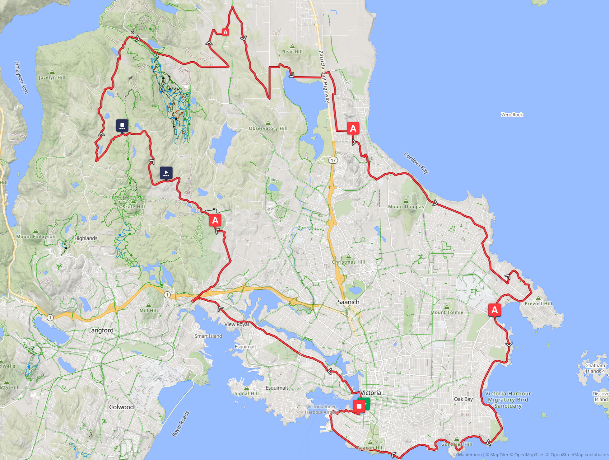
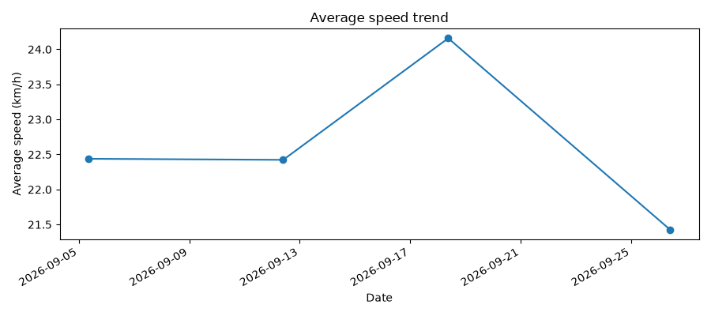
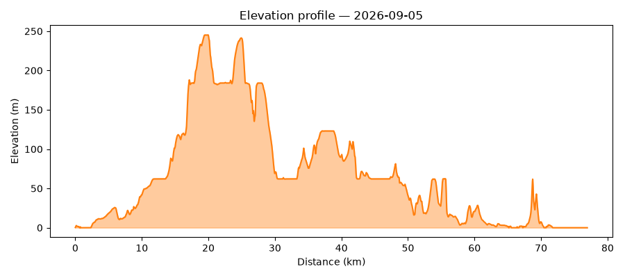
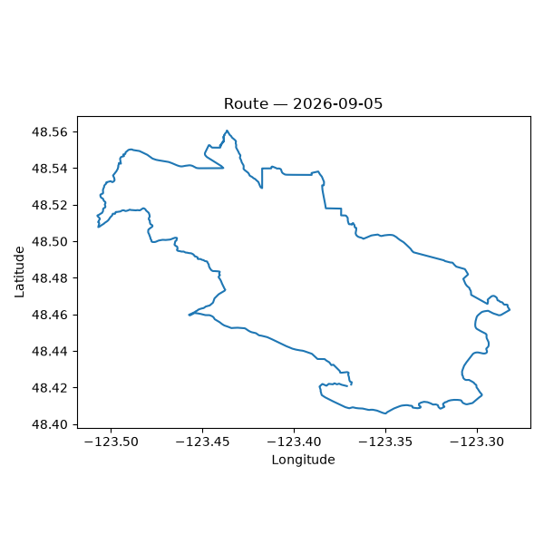

# Cycling

*Skeleton page — placeholder for the cycling getting-started guide, not the finished thing. See
"Still to do" below for what's missing.*

New to Python, or don't have dependencies installed yet? See [setup](setup.md) first.

## Example database

4 rides along the real Tour de Victoria 80&nbsp;km road-cycling route, fabricated (no real person,
device, or activity represented). Download `cordelia-sample-cycling.sqlite`, with its SHA-256
checksum and GPG signature, from [the downloads page](example-databases.md).

```bash
sqlite3 example-data/cordelia-sample-cycling.sqlite
```



[Download the route as a GPX file](tour-de-victoria-2026-80km.gpx) — the official 2026 Tour de
Victoria 80&nbsp;km route, exported from
[RideWithGPS](https://ridewithgps.com/routes/48156781).

## What a cycling activity looks like in Cordelia

*TODO: short tour of the tables a cycling activity populates (the running set plus `FileCreator`
and `Sport`) and what's different from running (e.g. `enhanced_speed` vs. legacy `Speed`) — plus a
Cordelia screenshot, matching running.md's.*

## Example reports

[`reports/cycling_report.py`](../reports/cycling_report.py) reads the example database above and
produces a couple of basic reports — read it and copy from it as a starting point for your own.

Summary metrics printed to stdout:

```
Rides:               4
Total distance:      307.8 km
Total time:          13.6 h
Average speed:       22.6 km/h
Best (fastest) ride: 24.2 km/h
Total ascent:        3396 m
Average heart rate:  158 bpm
```

An average-speed trend across all 4 rides:



An elevation profile for the first ride — the Tour de Victoria route is genuinely hilly, unlike
running's flat Ottawa River Pathway:



And a GPS route map for the first ride:



Run it yourself:

```bash
python3 reports/cycling_report.py
```

## Using your own data

The same script works against any Cordelia database, not just the bundled example — pass its path
with `--db`:

```bash
python3 reports/cycling_report.py --db path/to/your.sqlite
```

By default, plots are written to `reports/output/cycling/`; pass `--out-dir` to write them
somewhere else.

## Still to do

- The Cordelia-schema tour and screenshot noted above.

---

**More guides:** [Running](running.md) · [Kayaking](kayaking.md) · [Strength training](strength-training.md) · [Swimming](swimming.md) — or back to [Getting started](README.md).
