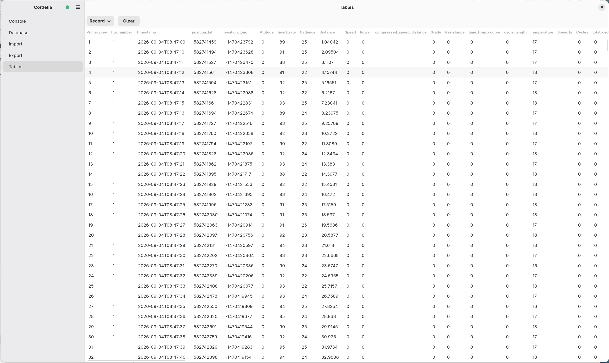
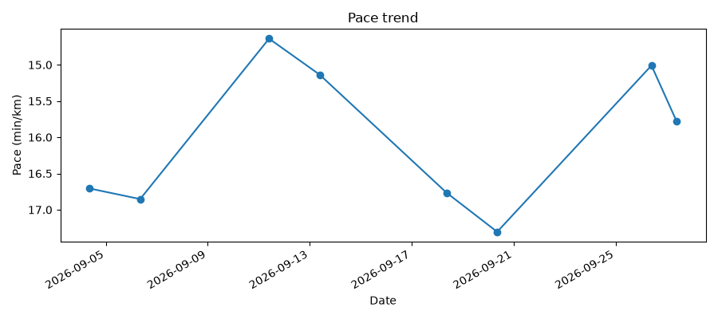
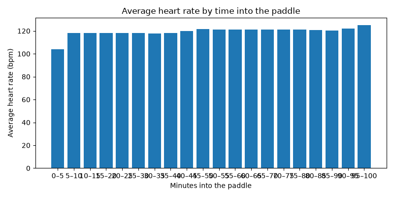
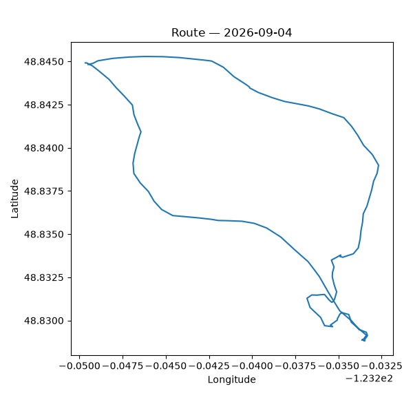

# Kayaking

New to Python, or don't have dependencies installed yet? See [setup](setup.md) first.

## Example database

8 out-and-back paddles, fabricated (no real person, device, or activity represented). Download
`cordelia-sample-kayaking.sqlite`, with its SHA-256 checksum and GPG signature, from
[the downloads page](example-databases.md).

```bash
sqlite3 example-data/cordelia-sample-kayaking.sqlite
```


## What a kayaking activity looks like in Cordelia

The `Record` table, viewed in Cordelia, for one paddle — note the `Speed` column reading `0`
throughout, the same legacy-field quirk cycling hits; the report script sidesteps it entirely,
deriving pace from `total_distance`/`total_timer_time` rather than a speed field. Also worth
noting: there's no wind field anywhere in Cordelia's schema, despite wind being one of the biggest
swings on paddling pace:



## Example reports

[`reports/kayaking_report.py`](../reports/kayaking_report.py) reads the example database above and
produces a couple of basic reports — read it and copy from it as a starting point for your own.

Summary metrics printed to stdout:

```
Paddles:             8
Total distance:      45.7 km
Total time:          12.2 h
Average pace:        16.02 min/km
Best (fastest) pace: 14.64 min/km
Average stroke rate: 22 strokes/min
Average heart rate:  119 bpm
```

A pace trend across all 8 paddles:



Average heart rate in five-minute buckets of elapsed time, across all 8 paddles:



And a GPS route map for the first paddle:



Run it yourself:

```bash
python3 reports/kayaking_report.py
```

## Using your own data

The same script works against any Cordelia database, not just the bundled example — pass its path
with `--db`:

```bash
python3 reports/kayaking_report.py --db path/to/your.sqlite
```

By default, plots are written to `reports/output/kayaking/`; pass `--out-dir` to write them
somewhere else.

---

**More guides:** [Running](running.md) · [Cycling](cycling.md) · [Strength training](strength-training.md) · [Swimming](swimming.md) — or back to [Getting started](README.md).
