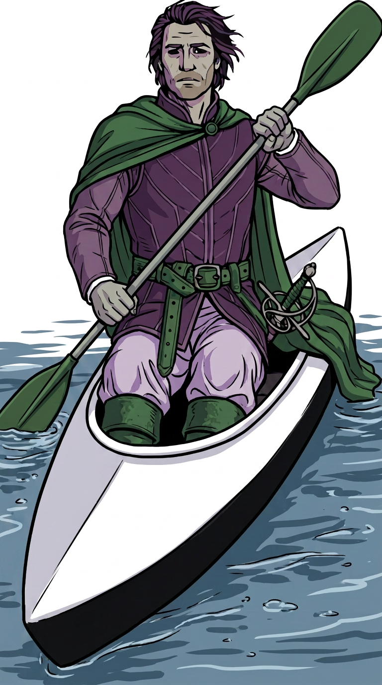
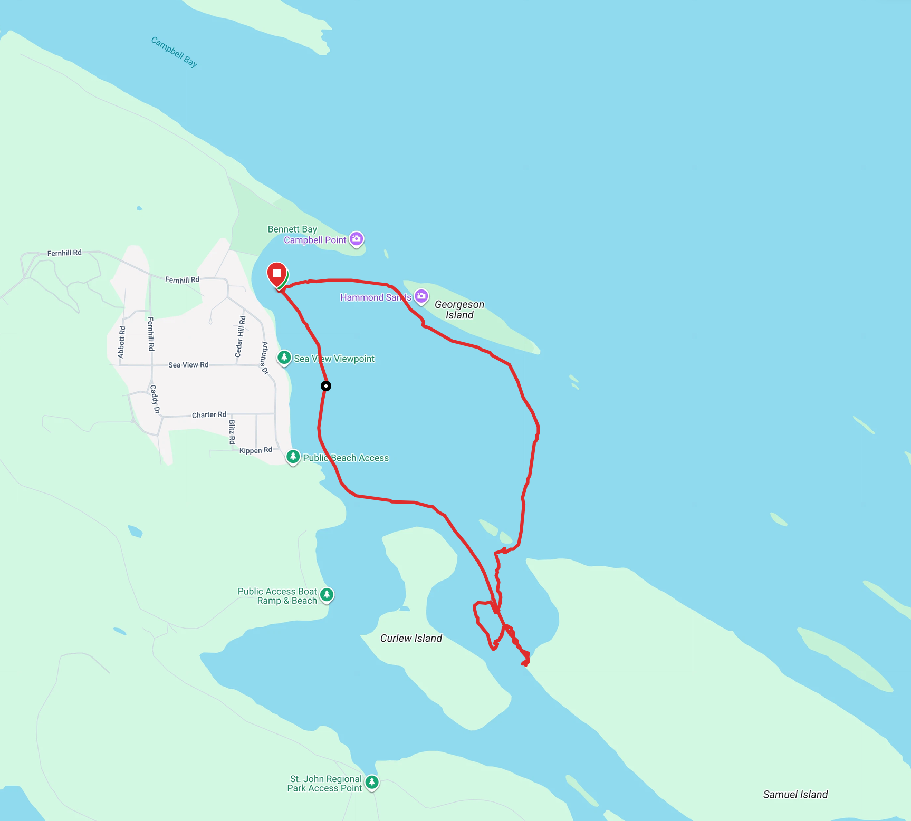

# Kayaking

*Skeleton page — placeholder for the kayaking getting-started guide, not the finished thing. See
"Still to do" below for what's missing.*

New to Python, or don't have dependencies installed yet? See [setup](setup.md) first.

## Example database

8 out-and-back paddles, fabricated (no real person, device, or activity represented). Download
`cordelia-sample-kayaking.sqlite`, with its SHA-256 checksum and GPG signature, from
[the downloads page](example-databases.md).

```bash
sqlite3 example-data/cordelia-sample-kayaking.sqlite
```



## What a kayaking activity looks like in Cordelia

*TODO: short tour of the tables a kayaking activity populates (same set as cycling) and the
wind-as-a-pace-effect detail worth calling out (no wind field exists anywhere in Cordelia's
schema).*

## Example reports

*Not written yet — Phase 3. Planned: a pace-trend line plot across the 8 paddles, and a GPS route
map.*

## Using your own data

*TODO: how to point whichever report script exists at your own Cordelia database instead of the
example one.*

---

**More guides:** [Running](running.md) · [Cycling](cycling.md) · [Strength training](strength-training.md) · [Swimming](swimming.md) — or back to [Getting started](README.md).
