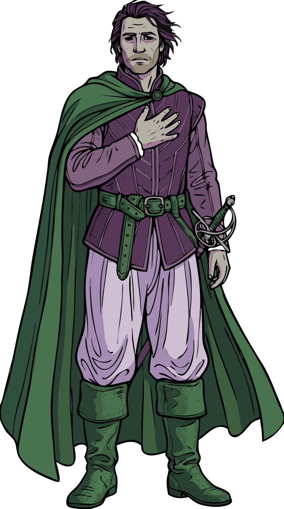

# Namesake

This repository is named for **Antonio**, the sea captain in Shakespeare's *Twelfth Night*.

Early in the play, Antonio rescues Sebastian after the shipwreck that opens the story, then takes
a real risk on his behalf: Illyria isn't safe for Antonio — he has enemies there from an old
skirmish — but he follows Sebastian into the city anyway, hands him his own money, and tells him to
go enjoy the town and find his own way. He doesn't try to manage what Sebastian does with it or
tag along to supervise. He just makes sure Sebastian is equipped to get started, then steps back.

That's the relationship this repo is meant to have with the people who use it: enough working
example code, sample data, and documentation to get you going quickly, without trying to be a
framework you depend on or a tool you have to keep coming back to. Copy what's useful, adapt it,
and go make it your own — same as Sebastian does.

*(Antonio doesn't get an easy ending for his trouble — he's arrested by Illyrian officers partway
through, and the play resolves around Sebastian and Viola rather than him. The metaphor is about
the help he gives at the start, not a promise about how things turn out.)*

Read more: [Antonio (Twelfth Night) — Wikipedia](https://en.wikipedia.org/wiki/Antonio_(Twelfth_Night)).
