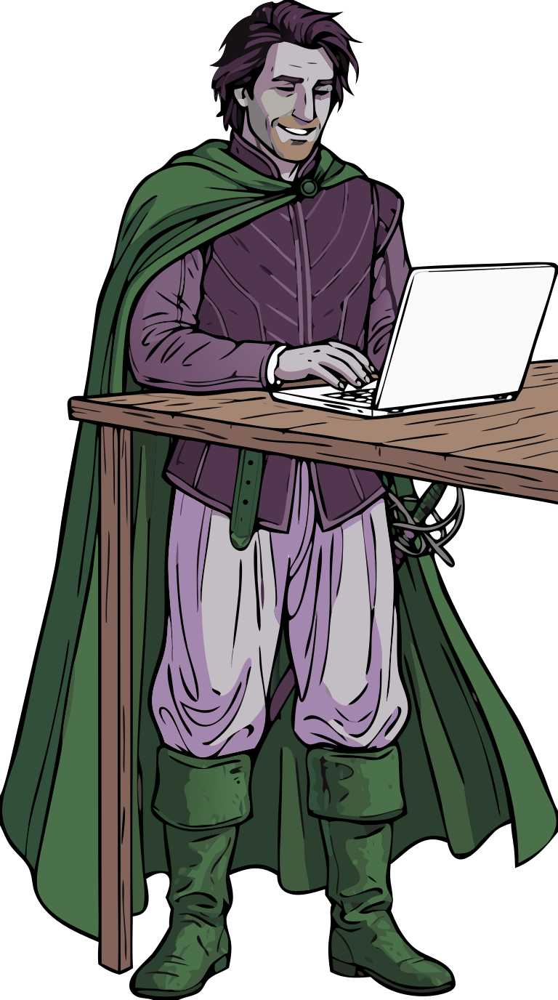

# Obtaining data

Two paths, depending on whether you already have a Cordelia database of your own.

## I just want to try antonio quickly

Use one of the six fabricated example databases — no Garmin device or Cordelia install required.
See [the downloads page](example-databases.md) to pick your sport, download the matching `.sqlite` file,
and verify its checksum and signature.

## I want to use my own real activity data

That's Cordelia's job, not antonio's — antonio only ever *reads* a Cordelia database, it doesn't
create one. Broadly:

1. Get `.FIT` files off your Garmin device or Garmin Connect account.
2. Import them into a Cordelia database.
3. Point antonio's report scripts at that database instead of an example one.

Cordelia's own help covers all three steps in detail — see
[venholaconsulting.ca/apps/help/](https://venholaconsulting.ca/apps/help/). This page won't
duplicate that documentation, just point at it.
