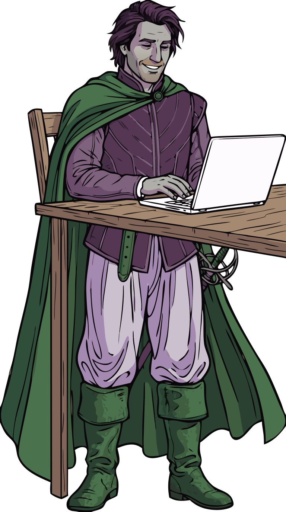

# Obtaining data

*Skeleton page — placeholder, not the finished thing. See "Still to do" below.*

Two paths, depending on whether you already have a Cordelia database of your own.

## I just want to try antonio quickly

Use one of the four fabricated example databases in
[`example-data/`](../example-data/) — no Garmin device or Cordelia install required. Pick your
sport from [getting-started.md](getting-started.md), download the matching `.sqlite` file, and
you're working with real Cordelia-schema data in a couple of minutes. See the root
[README](../README.md#example-databases) for the SHA-256/GPG verification steps.

## I want to use my own real activity data

That's Cordelia's job, not antonio's — antonio only ever *reads* a Cordelia database, it doesn't
create one. Broadly:

1. Get `.FIT` files off your Garmin device or Garmin Connect account.
2. Import them into a Cordelia database.
3. Point antonio's report scripts at that database instead of an example one.

*TODO: link out to Cordelia's own help pages once confirmed —*
*https://www.venholaconsulting.ca/apps/help/en/cordelia/obtaining-fit-files.html and*
*.../creating-database.html and .../importing-fit-files.html — rather than duplicating that*
*documentation here.*

## Still to do

- Confirm the exact Cordelia help-page URLs above and turn them into real links.
- Once a report script exists, the actual "point it at your database" instructions (a `--db` flag
  or similar) belong here or on each sport page — not decided yet.
