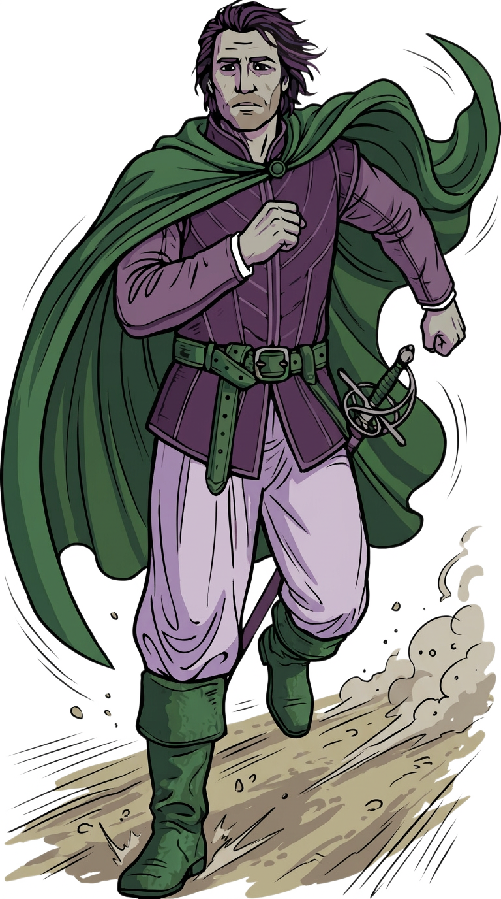
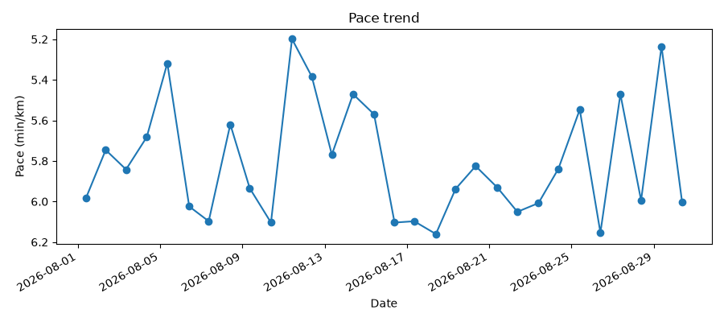
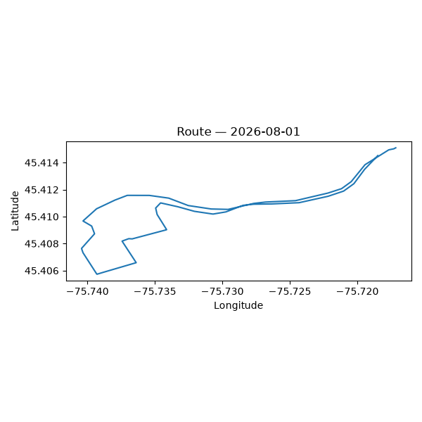

# Running

*Partial page — the example reports below are real, but "What a running activity looks like in
Cordelia" is still a placeholder. See "Still to do" below for what's missing.*

## Example database

[`cordelia-sample-running.sqlite`](../example-data/cordelia-sample-running.sqlite) — 30
consecutive daily ~5&nbsp;km runs along a real public route, fabricated (no real person, device,
or activity represented). SHA-256 checksum and GPG signature ship alongside it; see the root
[README](../README.md#example-databases) for how to verify them.

```bash
sqlite3 example-data/cordelia-sample-running.sqlite
```

## What a running activity looks like in Cordelia

*TODO: short tour of the tables a running activity actually populates (`FileID`, `Activity`,
`Event`, `DeviceInfo`, `Session`, `Lap`, `Record`) and the two encoding gotchas that trip people up
first — semicircle GPS, ISO 8601 timestamps.*

## Example reports

[`reports/running_report.py`](../reports/running_report.py) reads the example database above and
produces a couple of basic reports — read it and copy from it as a starting point for your own.

Summary metrics printed to stdout:

```
Runs:                30
Total distance:      150.8 km
Total time:          14.6 h
Average pace:        5.80 min/km
Best (fastest) pace: 5.20 min/km
Average heart rate:  145 bpm
```

A pace trend across all 30 runs:



And a GPS route map for the first run:



Run it yourself:

```bash
python3 reports/running_report.py
```

## Using your own data

The same script works against any Cordelia database, not just the bundled example — pass its path
with `--db`:

```bash
python3 reports/running_report.py --db path/to/your.sqlite
```

By default, plots are written to `reports/output/running/`; pass `--out-dir` to write them
somewhere else.

## Still to do

- "What a running activity looks like in Cordelia" above is still a placeholder — needs the table
  tour and the semicircle/ISO 8601 gotchas.
