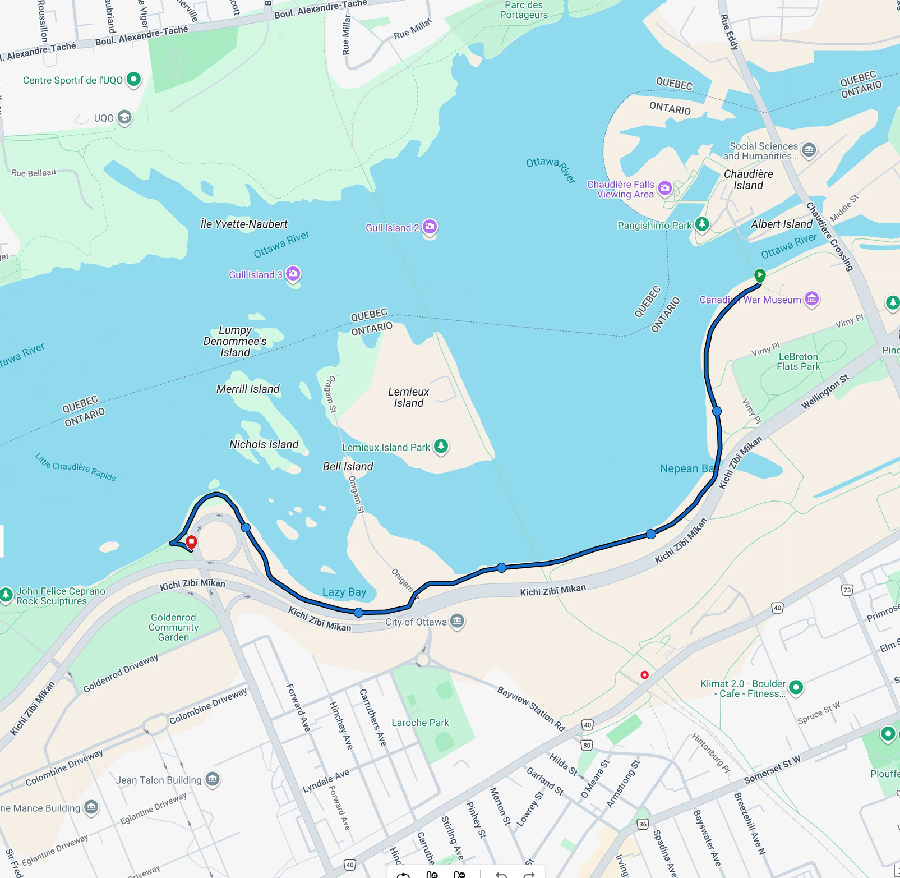
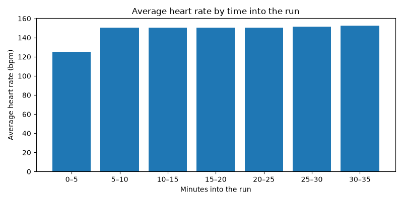
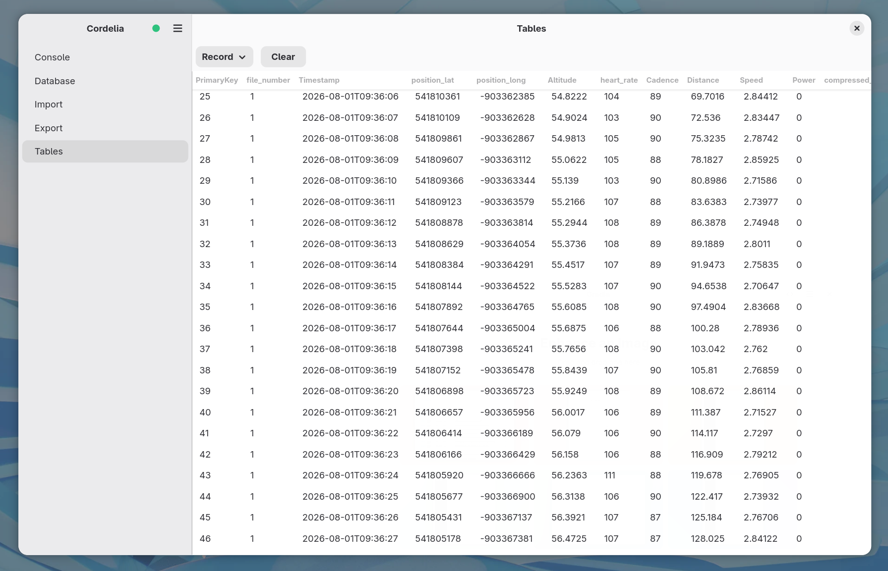

# Running

New to Python, or don't have dependencies installed yet? See [setup](setup.md) first.

## Example database

25 runs of ~5&nbsp;km along a real public route, one a day across August 1–29, 2026, with Sundays
as rest days; fabricated (no real person, device or activity represented). Download
`cordelia-sample-running.sqlite`, with its SHA-256 checksum and GPG signature, from
[the downloads page](example-databases.md).

```bash
sqlite3 example-data/cordelia-sample-running.sqlite
```

The route itself is real: an out-and-back along the **Ottawa River Pathway**, between LeBreton
Flats (near the Canadian War Museum) and Tunney's Pasture.



[Download the route as a GPX file](ottawa-river-pathway.gpx), built from
[OpenStreetMap](https://www.openstreetmap.org/) way data (© OpenStreetMap contributors, licensed
[ODbL](https://opendatacommons.org/licenses/odbl/)).

## Example reports

[`reports/running_report.py`](../reports/running_report.py) reads the example database above and
produces a couple of basic reports. Read it and copy from it as a starting point for your own.

Summary metrics printed to stdout:

```
Runs:                25
Total distance:      125.7 km
Total time:          12.2 h
Average pace:        5.81 min/km
Best (fastest) pace: 5.20 min/km
Average heart rate:  146 bpm
```

A pace trend across all 25 runs:


Average heart rate in five-minute buckets of elapsed time, across all 25 runs:



And a GPS route map for the first run:


Run it yourself:

```bash
python3 reports/running_report.py
```

## Using your own data

The script works against any Cordelia database. Pass the path with `--db`:

```bash
python3 reports/running_report.py --db path/to/your.sqlite
```

Plots go to `reports/output/running/` by default; pass `--out-dir` to write them somewhere else.

## What a running activity looks like in Cordelia

`Record` holds one row per second of GPS and heart-rate data. A running activity also populates
`FileID` (file-level metadata: device, creation time), `Activity` (one row tying the file
together), `Session` and `Lap` (the summary metrics the report script reads), `Event` (start and
stop markers) and `DeviceInfo` (the recording device's details).

The `Record` table, viewed in Cordelia, for one run:



---

**More guides:** [Cycling](cycling.md) · [Kayaking](kayaking.md) · [Strength training](strength-training.md) · [Swimming](swimming.md). Or back to [Getting started](README.md).
