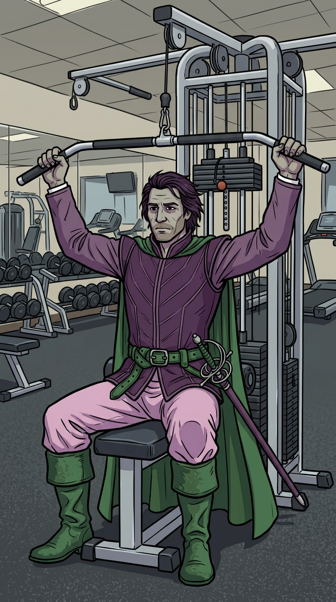

# Strength training

*Skeleton page — placeholder for the strength-training getting-started guide, not the finished
thing. See "Still to do" below for what's missing.*

New to Python, or don't have dependencies installed yet? See [setup](setup.md) first.

## Example database

8 sessions (51 work sets, 50 rest periods each), fabricated (no real person, device, or activity
represented). Download `cordelia-sample-strength-training.sqlite`, with its SHA-256 checksum and
GPG signature, from [the downloads page](example-databases.md).

```bash
sqlite3 example-data/cordelia-sample-strength-training.sqlite
```

## What a strength-training activity looks like in Cordelia

Genuinely different shape from the other three sports: no GPS, no `Distance`, no `Speed` — instead
a `SetX` table (one row per work set or rest period, with `Repetitions`, `Weight`, `Duration`, and
FIT's own exercise-category codes) alongside `Session`/`Lap` summaries and a heart-rate-only
`Record` table.

*TODO: short tour of `SetX`'s columns and how they map to what you'd see in Garmin Connect.*

## Example reports

*Not written yet — Phase 3. "Route map" and "pace trend" don't apply here — needs its own report
idea (e.g. weight/volume progression across sessions, or work-vs-rest time breakdown).*

## Using your own data

*TODO: how to point whichever report script exists at your own Cordelia database instead of the
example one.*

---

**More guides:** [Running](running.md) · [Cycling](cycling.md) · [Kayaking](kayaking.md) · [Swimming](swimming.md) — or back to [Getting started](README.md).
