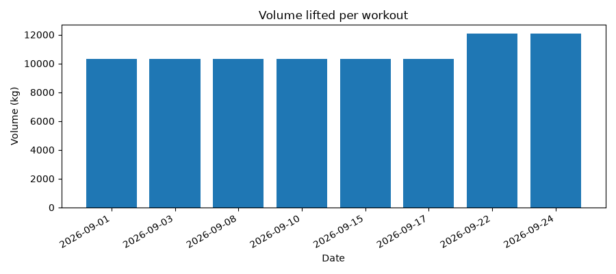
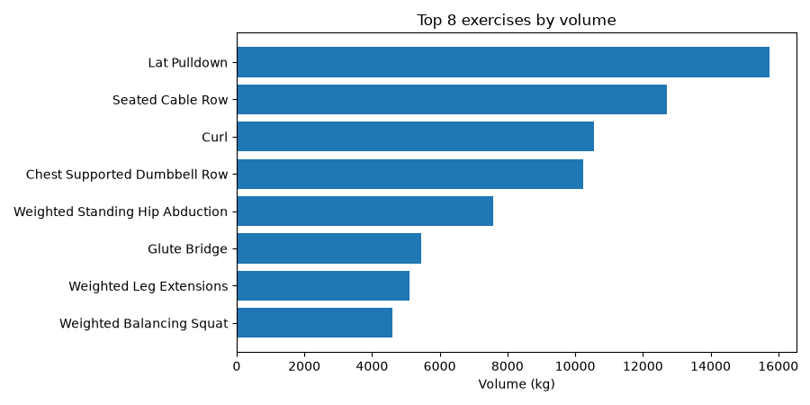
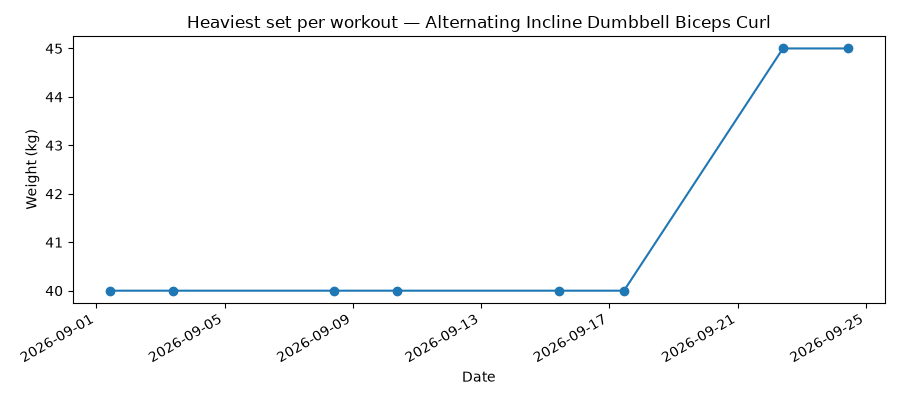

# Strength training

New to Python, or don't have dependencies installed yet? See [setup](setup.md) first.

## Example database

8 sessions (51 work sets, 50 rest periods each), fabricated (no real person, device, or activity
represented). Download `cordelia-sample-strength-training.sqlite`, with its SHA-256 checksum and
GPG signature, from [the downloads page](example-databases.md).

```bash
sqlite3 example-data/cordelia-sample-strength-training.sqlite
```

## What a strength-training activity looks like in Cordelia

Genuinely different shape from the other three sports: no GPS, no `Distance`, no `Speed` — instead
a `SetX` table (one row per work set or rest period, with `Repetitions`, `Weight`, `Duration`, and
FIT's own exercise-category codes) alongside `Session`/`Lap` summaries and a heart-rate-only
`Record` table.

## Example reports

[`reports/strength_training_report.py`](../reports/strength_training_report.py) reads the example
database above and produces a few basic reports — read it and copy from it as a starting point for
your own.

Summary metrics printed to stdout:

```
Workouts:            8
Date range:          2026-09-01 to 2026-09-24
Working sets:        408 (400 rest periods)
Total repetitions:   3632
Total volume:        86,040 kg
Heaviest set:        60 kg
Average workout:     51 min
Average heart rate:  126 bpm
Distinct exercises:  20
Biggest exercise:    Lat Pulldown (15,750 kg)
```

And the routine itself. Every session replays the same one, so these are exact counts rather than
averages — and the order is the order performed, warm-up crunches through to the closing stretches:

| | Exercise | Sets | Reps | Weight | Comments |
|:---:|:---|---:|---:|---:|:---|
|  | Weighted Crunch | 3 | 8–11 | 15–20 kg | |
|  | Curl † | 3 | 10–11 | 40–45 kg | |
|  | Shrug † | 3 | 8–11 | 15–20 kg | |
|  | Overhead Barbell Press | 3 | 10 | 15–20 kg | |
|  | Chest Supported Dumbbell Row | 3 | 9–11 | 40–45 kg | |
|  | Weighted Leg Extensions | 3 | 10 | 20–25 kg | |
|  | Seated Cable Row | 3 | 10–11 | 50–55 kg | |
|  | Lat Pulldown | 3 | 11–12 | 55–60 kg | |
|  | Elbow To Knee Crunch | 3 | 10 | None recorded | |
|  | Weighted Balancing Squat | 3 | 9 | 20–25 kg | |
|  | Stretch Lying It Band | 3 | 9–11 | 10–15 kg | |
|  | Glute Bridge | 3 | 6–11 | 25–30 kg | |
|  | Chin Up | 3 | 9–10 | None recorded | |
|  | Push Up † | 4 | 6–10 | None recorded | |
|  | Weighted Standing Hip Abduction | 3 | 6–9 | 40–45 kg | |
|  | Stretch Shoulder | 1 | 1 | None recorded | |
|  | Hamstring Stretch | 1 | 1 | None recorded | |
|  | Stretch Side | 1 | 2 | None recorded | |
|  | Groiners | 1 | 1 | None recorded | |
|  | Stretch Forearms | 1 | 2 | None recorded | |
| | **Total** | **51** | | | |

† Carries a category code but no more specific subtype, so it reads as the broad movement rather
than a named variant. That's the `COALESCE` fallback described below, visible in the data.

**"None recorded"** is weight 0, which covers two things the FIT file can't tell apart: genuine
bodyweight work (the chin-ups, push-ups and crunches) and the closing stretches, which Garmin
Connect displays as "--" rather than "Bodyweight". Where a weight *is* recorded it reads as a
range, because the last two sessions add 5 kg to every already-weighted set — a progressive-overload
step you can see in the progression plot below.

The script prints this same table to stdout, so it stays in step with whatever database you point
it at rather than being maintained by hand here.

Volume — reps × weight — totalled for each workout:



The exercises that contributed the most of that volume:



And progression for the biggest one by volume, the heaviest set recorded in each workout:



Run it yourself:

```bash
python3 reports/strength_training_report.py
```

### Where the exercise names come from

A `SetX` row doesn't store "Seated Cable Row". It stores two Garmin codes — a category
(`raw_category_garmin_key`, e.g. `23`) and a more specific subtype
(`raw_category_subtype_garmin_key`, e.g. `23 18`) — and Cordelia's `better_labels_definitions` and
`better_labels_lookup` tables turn those into readable text. The script joins them with a
`COALESCE` that prefers the subtype ("Seated Cable Row"), falls back to the category ("Row"), and
falls back again to "Unspecified" when a set carries neither code.

Every set in this example database carries a code, so nothing lands in that last bucket here. Your
own data probably will: a watch counts reps whether or not anyone told it what movement was being
performed, and a set logged without an exercise selected has nothing to name it. Those sets are
real work and stay in the totals — the summary prints a "Sets with no exercise recorded" line
whenever there are any — they just can't be charted or listed per exercise.

The middle branch of that `COALESCE` is the one marked † in the table above: **Curl**, **Shrug**
and **Push Up** carry a category code and no subtype, so they read as the broad movement.
Everything else in the example resolves to a specific named variant.

Those labels exist in six locales, though that mostly buys you the *category* names — Garmin's
per-exercise subtype names are largely untranslated in the source data. Of the twenty exercises
above, only two change in French — both of them category-level, and French keeps "Curl" as-is:

```bash
python3 reports/strength_training_report.py --locale fr
# Shrug   ->  Haussement d'épaules
# Push Up ->  Pompe
```

## Using your own data

The same script works against any Cordelia database, not just the bundled example — pass its path
with `--db`:

```bash
python3 reports/strength_training_report.py --db path/to/your.sqlite
```

By default, plots are written to `reports/output/strength-training/`; pass `--out-dir` to write
them somewhere else.

One thing to know before you read too much into your own numbers: edits you make in Garmin Connect
after a workout stay in Garmin Connect. They never propagate back into the FIT file. That applies
to a set's weight — so `SetX.Weight` is whatever the watch recorded at the time — and it applies
just as much to the **exercise name**. If you corrected an exercise in Connect after the session,
the file still holds whatever the watch guessed, and that is what these reports will name. Connect
showing one thing and this script showing another is expected, not a bug in either.

---

**More guides:** [Running](running.md) · [Cycling](cycling.md) · [Kayaking](kayaking.md) · [Swimming](swimming.md) — or back to [Getting started](README.md).
