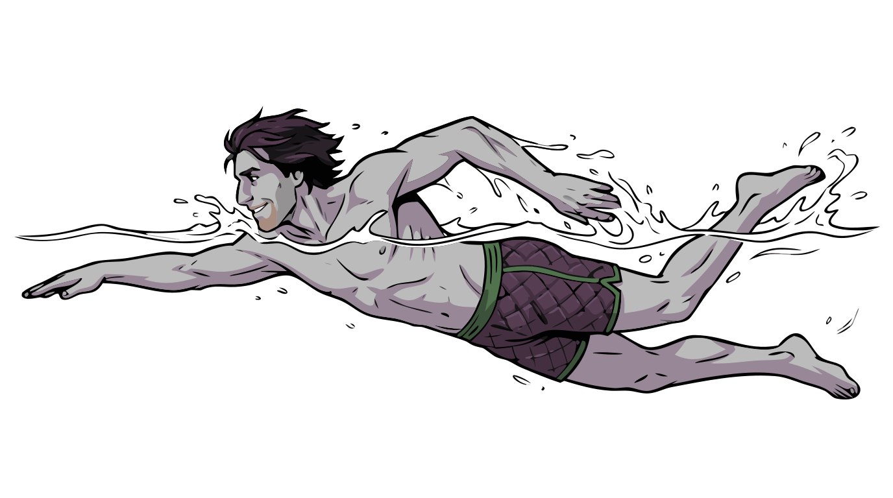
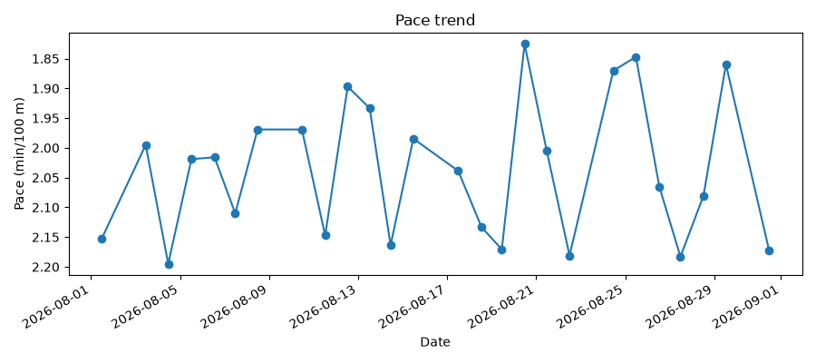
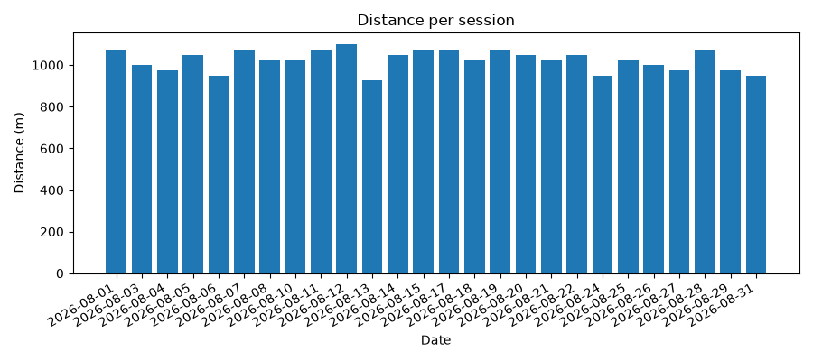
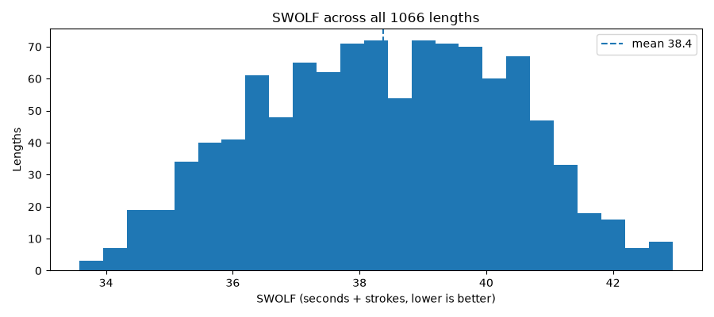

# Swimming

New to Python, or don't have dependencies installed yet? See [setup](setup.md) first.

## Example database

26 sessions, one per day through August 2026 (Sundays off), 25&nbsp;m indoor pool, freestyle,
fabricated (no real person, device, or activity represented). Download
`cordelia-sample-swimming.sqlite`, with its SHA-256 checksum and GPG signature, from
[the downloads page](example-databases.md).

```bash
sqlite3 example-data/cordelia-sample-swimming.sqlite
```

## What a swimming activity looks like in Cordelia

Pool swimming is the only sport in this repo with a populated `Length` table — one row per pool
length, 1,066 of them across the 26 example sessions. Each row carries that single length's
`total_timer_time`, `total_strokes`, `avg_speed`, `avg_swimming_cadence`, and a `swim_stroke` code.
It sits below `Lap` (4 per session here) in the same hierarchy the other sports use, giving you a
finer grain than any of them: not just "this swim", but "this one 25-metre length".

`Session` adds the swim-specific summary fields — `pool_length`, `number_lengths`,
`total_strokes`, `avg_stroke_count`, `avg_stroke_distance` — so most session-level questions never
need the `Length` table at all.

`Record` is present and busy (32,596 rows, one per second, with `heart_rate`, `distance` and
`speed`), but **every `position_lat` and `position_long` is NULL**. A watch has no GPS fix
underwater in a pool, so there is nothing to map. That absence is the main structural difference
from running, cycling and kayaking; `cadence` is empty too, since swimming cadence lives in
`Length.avg_swimming_cadence` instead.

## Example reports

[`reports/swimming_report.py`](../reports/swimming_report.py) reads the example database above and
produces a few basic reports — read it and copy from it as a starting point for your own.

Summary metrics printed to stdout:

```
Sessions:              26
Date range:            2026-08-01 to 2026-08-31
Total distance:        26.6 km
Total time:            9.1 h
Average pace:          2.04 min/100 m
Best (fastest) pace:   1.83 min/100 m
Pool length:           25 m
Lengths swum:          1066
Total strokes:         10,634
Average per length:    10.0 strokes, 28.4 s
Average SWOLF:         38.4
Average heart rate:    108 bpm
Stroke:                Freestyle only, all 1066 lengths
```

A pace trend across the month, in minutes per 100&nbsp;m:



Distance swum in each session:



And a SWOLF distribution built from the `Length` table — one observation per pool length, not per
session:



SWOLF ("swimmer's golf") is the seconds a length took plus the strokes it took, and lower is
better. It's worth plotting alongside pace because it catches something pace alone hides: you can
always swim a length faster by thrashing, but that costs strokes, so the score only improves when
speed and efficiency improve together.

Run it yourself:

```bash
python3 reports/swimming_report.py
```

### Where the stroke names come from

`Length.swim_stroke` stores a Garmin code, not a name. Cordelia's `better_labels_definitions` and
`better_labels_lookup` tables translate it — the definition row matches on the `swim_stroke` domain
plus the code, and the lookup row supplies the text for one locale. Those labels exist in six
locales, so the same script prints stroke names in any of them:

```bash
python3 reports/swimming_report.py --locale de
```

Every length in this example database is freestyle, so the report states that in one line rather
than drawing a stroke breakdown that would be a single bar. Against a mixed-stroke database the
same summary lists each stroke with its count.

## Using your own data

The same script works against any Cordelia database, not just the bundled example — pass its path
with `--db`:

```bash
python3 reports/swimming_report.py --db path/to/your.sqlite
```

By default, plots are written to `reports/output/swimming/`; pass `--out-dir` to write them
somewhere else.

---

**More guides:** [Running](running.md) · [Cycling](cycling.md) · [Kayaking](kayaking.md) · [Strength training](strength-training.md) — or back to [Getting started](README.md).
